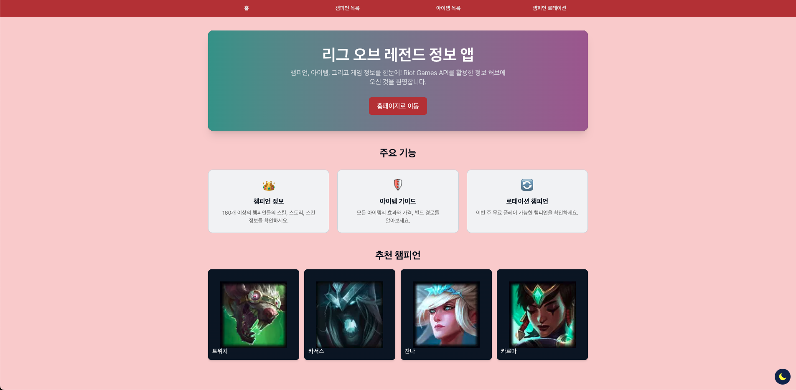
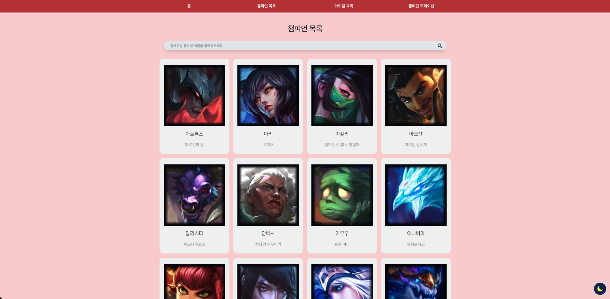
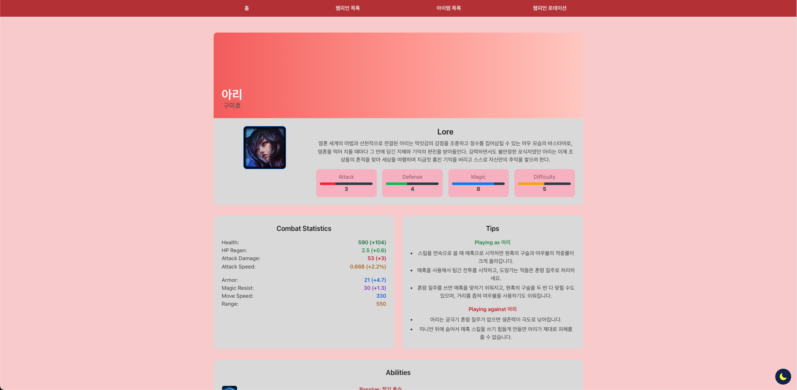
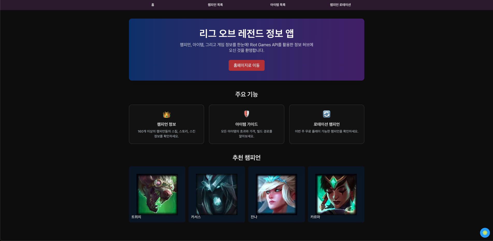
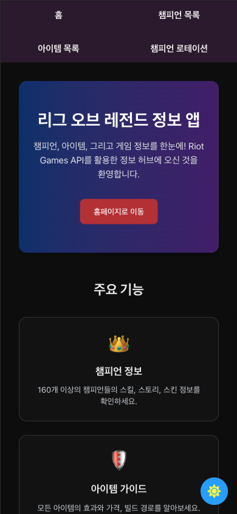

# 😈 LOL Stats Tracker

리그 오브 레전드의 챔피언 정보를 한눈에 확인할 수 있는 반응형 웹 애플리케이션입니다. Riot Games API를 활용하여 챔피언 데이터와 로테이션 정보를 제공합니다.

## 💡 주요 기능

- **챔피언 목록 조회**: 모든 리그 오브 레전드 챔피언 정보 브라우징
- **챔피언 검색**: 이름을 통한 빠른 챔피언 검색 기능
- **챔피언 상세 정보**: 각 챔피언의 스킬, 스토리등 상세 정보 제공
- **실시간 로테이션**: 현재 무료 로테이션 챔피언 / 신규 플레이어 무료 로테이션 챔피언 목록 제공
- **다크 모드**: 사용자 환경에 맞는 밝은/어두운 테마 지원
- **반응형 디자인**: 모바일, 태블릿, 데스크톱 등 모든 화면 크기에 최적화

## ⚒️ 기술 스택

- **프론트엔드**: Next.js, React, TypeScript
- **상태 관리**: TanStack Query (React Query)
- **스타일링**: Tailwind CSS
- **API**: Riot Games API
- **반응형**: 모든 디바이스 지원

## ⭐️ 렌더링 전략

다양한 Next.js 렌더링 전략을 활용하여 최적의 성능과 사용자 경험을 제공합니다:

- **챔피언 목록**: ISR(Incremental Static Regeneration) - 정기적으로 새로운 데이터로 정적 페이지 업데이트
- **챔피언 상세**: SSR(Server-Side Rendering) - 요청 시점에 서버에서 렌더링하여 최신 데이터 제공
- **아이템 정보**: SSG(Static Site Generation) - 빌드 시점에 정적 페이지 생성으로 빠른 로딩
- **로테이션 정보**: CSR(Client-Side Rendering) - 실시간 데이터 반영을 위한 클라이언트 측 렌더링

## 📋 설치 방법

1. 저장소 복제

```bash
git clone https://github.com/sum529-create/lol-stats-tracker.git
cd lol-stats-tracker
```

2. 의존성 설치

```bash
pnpm install
```

3. 환경 변수 설정
   `.env.local` 파일을 생성하고 다음 변수를 설정하세요:

```
NEXT_PUBLIC_RIOT_API_KEY=your_riot_api_key_here
```

4. 개발 서버 실행

```bash
pnpm dev
```

## 📕 사용 방법

- **홈 화면**: 추천 챔피언과 현재 로테이션 챔피언을 확인할 수 있습니다.
- **챔피언 목록**: 모든 챔피언을 탐색하고 검색할 수 있습니다.
- **상세 페이지**: 챔피언을 클릭하여 상세 정보를 확인할 수 있습니다.
- **테마 전환**: 상단 메뉴의 버튼으로 다크 모드/라이트 모드를 전환할 수 있습니다.
- **모바일 사용**: 모바일에서도 동일한 기능을 편리하게 이용할 수 있습니다.

## 🌄 스크린샷
| 💫 홈페이지                     |
| -------------------------------------------- |
|  |

| 🎯 챔피언 목록페이지                     |
| -------------------------------------------- |
|  |

| 📖 챔피언 상세페이지                    |
| --------------------------------------------- |
|  |

| 🔥 다크 모드 시                     |
| --------------------------------------------------- |
|  |

| 📱 반응형 구현                     |
| --------------------------------------------------- |
|  |

## 🍒 API 참조

이 프로젝트는 [Riot Games API](https://developer.riotgames.com/)의 Data Dragon API를 활용합니다.

## 👑 라이센스

이 프로젝트는 MIT 라이센스 하에 배포됩니다.

---

_이 프로젝트는 Riot Games의 공식 제품이 아니며, Riot Games 또는 League of Legends와 공식적으로 연관되어 있지 않습니다._
